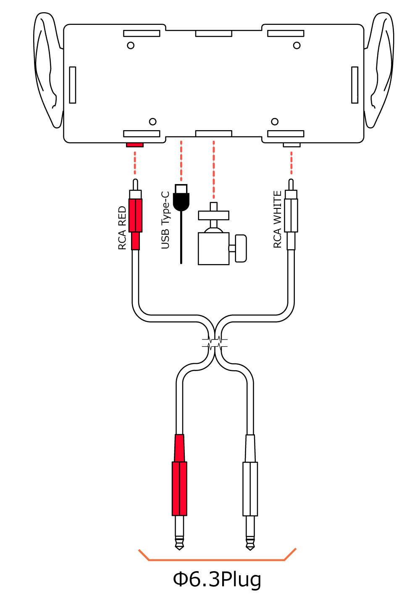

<head>
<link rel="stylesheet" href="style.css">
</head>

[TOP](index.md) / [接続方法](02Connect.md) / 基本的な接続方法

# 添付品を用いた配線図(対Φ6.3ジャック)

- 美耳本体  
- (付属) 赤白RCA - 赤白Φ6.3プラグ ケーブル   
- (付属)3脚ネジ延長アダプタ    
- (別売)USB Type-Cケーブル - USB電源  

上記を参考に接続してください。  

Φ6.3Plug側は音声入力を行いたい機器に対して接続してください。  

# 注意点

- 美耳に対して必ず電源を投入しないと録音ができません。   
録音をする際は上部の赤いLEDが光っていることを確認して下さい。

- XLR変換ケーブルにつきましては動作を保証しておりません。  
オーディオインターフェイスにΦ6.3フォーンジャック用コネクタや  
コンボジャックがある場合は  
付属ケーブルなどを用いて接続を行ってください。  
<strong>XLR変換ケーブルを経由して使用する際は48Vファントム電源を加えないようご注意ください。</strong>

  <footer>
    
Copyright © 2023 Bit Trade One, LTD. All rights reserved.

  </footer>
