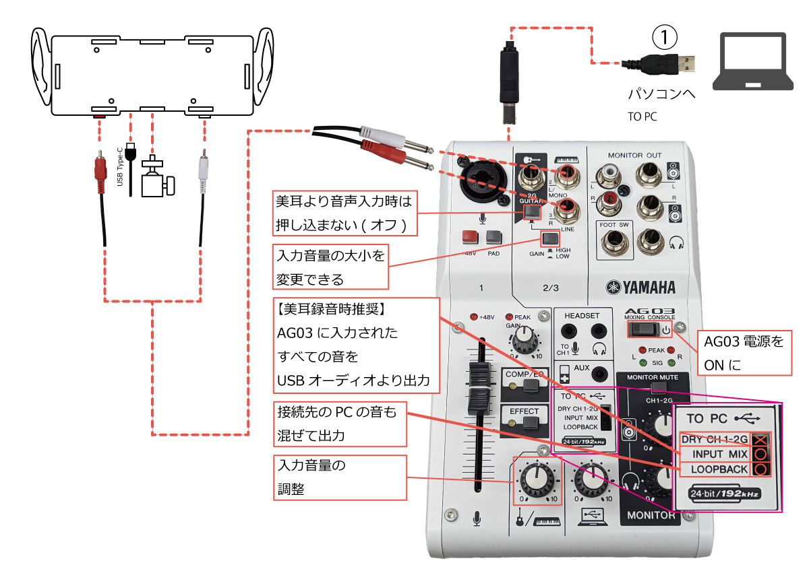

<head>
<link rel="stylesheet" href="style.css">
</head>

[TOP](index.md) / [接続方法](02Connect.md) / 機種別・YAMAHA AG03

# 配線図(対PC)  

- 美耳本体
- (付属)赤白RCA - 赤白Φ6.3プラグ ケーブル  
- (付属)3脚ネジ延長アダプタ  
- (別売)USB Type-Cケーブル - USB電源  
- (別売)AG03  
- (別売)①USB Type-B-Aケーブル  

上記を参考に接続してください。  
**※電源を切った状態で美耳と接続先のオーディオインタフェースを接続してください。**

> AG03の詳しい操作説明は公式サイトや取扱説明書をご確認ください。

  <footer>
    
Copyright © 2023 Bit Trade One, LTD. All rights reserved.

  </footer>
