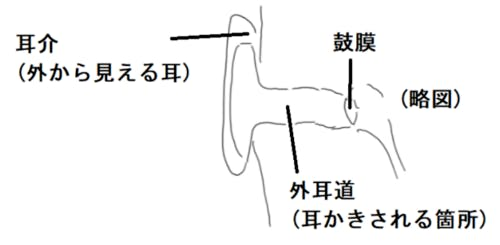
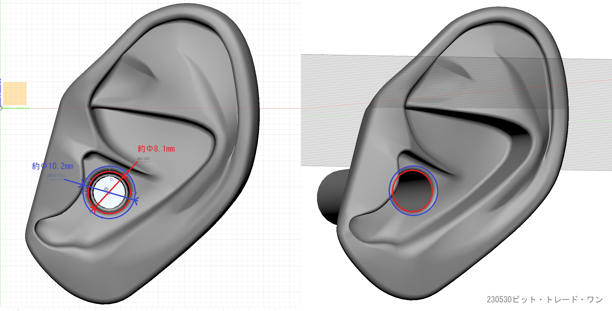

<head>
<link rel="stylesheet" href="style.css">

  
</head>

 [TOP](index.md) / [Q&A](1100_FAQ.md)  

 よくある質問を掲載しています。  
 
<!-- 
### Q：[あかさたな？](#Q1)  
### Q：[ABCDEFG？](#Q2)
-->

### Q1：<a href="#BMMFAQ1">耐水性や防水性はありますか？</a>
### Q2：<a href="#BMMFAQ2">付属のケーブル以外も使えますか？</a>
### Q3：<a href="#BMMFAQ3">外耳道の特性を教えてください</a>
### Q4：<a href="#BMMFAQ4">耳部にイヤホンを装着する事は可能ですか？</a>

---
 
<h1 id="BMMFAQ1">Q1：耐水性や防水性はありますか？</h1>

本製品にて、オイル耳マッサージ等の少量の液体を使用したASMRを収録しても大丈夫でしょうか。  
マイク部分や内部に液体が入り込んで破損してしまう可能性などはあるのでしょうか。  
また、外での収録中に急な雨が降ってきてしまった状況等、製品に水が不意に触れてしまった場合の耐性についても教えてください。  

### A：マイク・回路部ともに、耐水性はありません。

耳奥のマイク自体に液体が入り込むと故障の危険があるため、  
少量の液体を美耳の耳の中に入れる場合は耳穴を水平より下方に傾ける等により対策ください。  
  
筐体のアクリルケースについても防水仕様ではなく、ゴムパッキン加工など施していないため、  
隙間より浸水し回路がショートする危険がございます。  
急な雨などの際には速やかに防水カバンなどへ収納をお願いします。  
  
---
 
<h1 id="BMMFAQ2">Q2：付属のケーブル以外も使えますか？ </h1>

### A：使用可能です。  

RCA - ??? となっている市販の変換ケーブルが様々販売されています。  
出力先に合わせてケーブルを変更してご使用ください。

---

 
<h1 id="BMMFAQ3">Q3：外耳道の特性を教えてください </h1>

### A：可能な範囲でお答えします。  
まず、人間の耳は耳介→外耳道→鼓膜へと音が伝達されて音を認識します。  
外耳道が片方が閉じた管状であるため、管の長さの4倍の波長が共鳴する音響管共鳴という現象が起こり、個人差はありますが2000〜4000Hzの音を特に聞き取りやすくなっています。  
(引用 [産総研 人間の耳に合わせた国際基準？より](https://www.aist.go.jp/science_town/living/living_10/living_10_02.html))  

美耳は人間の耳の中まで再現しているため、同じように3000Hz辺りの音が耳の中の管によって大きな音として現れ、
耳の特性が強調された音を録音することができます。
耳かき音が録れるだけでなく、心地の良いASMR向けの録音が可能です。  
しかし、それは通常のマイクと異なるクセでもあります。
音量によりますがフラットな特性のマイクを使用したときと比べて楽器等の録音では偏った音響特性で録音してしまう可能性がございます。

美耳の耳を外すとフラットな音の特性が現れます。

---

 
<h1 id="BMMFAQ4">Q4：耳部にイヤホンを装着する事は可能ですか？ </h1>

### A：イヤホンの形状により異なります  

イヤホンの装着につきましては、イヤホンの形状により異なります。  
耳の穴など実際の耳よりデフォルメされている部分があるため、  
恐れ入りますが人の耳に収まるイヤホンであれば美耳に付けられるという仕様にはなっておりません。  

耳部の寸法につきましては、下記画像をご覧ください。   

  

さらに以下のリンクより耳部の3Dモデルを配布しております。詳細な寸法はこちらをご参照ください。  
[耳部3D配布リンク(GitHub)](https://github.com/bit-trade-one/ADBMM/tree/master/mimi_ear3D)

---

  <footer>
    
Copyright © 2023 Bit Trade One, LTD. All rights reserved.

  </footer>