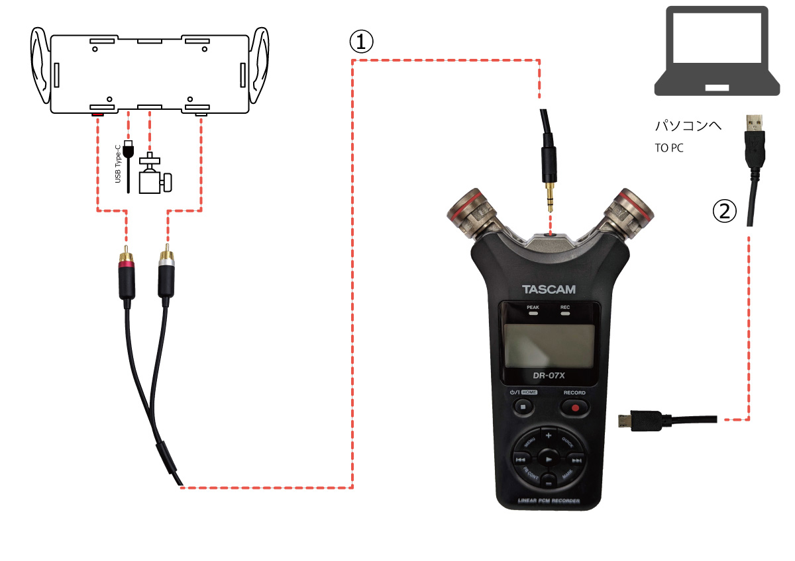

<head>
<link rel="stylesheet" href="style.css">
</head>

[TOP](index.md) / [接続方法](02Connect.md) / 機種別・TASCAM DR-07X

# 配線図(単体)  

- 美耳本体
- (付属)3脚ネジ延長アダプタ  
- (別売)①赤白RCA - 3極 オーディオミニプラグ ケーブル  
- (別売)USB Type-Cケーブル - USB電源  
- (別売)DR-07X  

上記を参考に接続してください。  
**※美耳と接続先の電源が切れた状態で接続を行ってください。**

> 音量が大きい場合はDR-07Xの入力レベルを下げてください。  
> DR-07Xの詳しい操作説明は公式サイトや取扱説明書をご確認ください。

---

# 配線図(対PC)  
オーディオインターフェイスとしての使用  
(DR-07X内メニューより設定が必要です。)    

- 美耳本体
- (付属)3脚ネジ延長アダプタ  
- (別売)①赤白RCA - 3極 オーディオミニプラグ ケーブル  
- (別売)USB Type-Cケーブル - USB電源  
- (別売)DR-07X  
- (別売)②USB MicroUSB-Aケーブル  

上記を参考に接続してください。  
**※美耳と接続先の電源が切れた状態で接続を行ってください。**

> 音量が大きい場合はDR-07Xの入力レベルを下げてください。  
> DR-07Xの詳しい操作説明は公式サイトや取扱説明書をご確認ください。

  <footer>
    
Copyright © 2023 Bit Trade One, LTD. All rights reserved.

  </footer>
